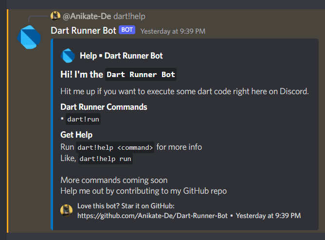
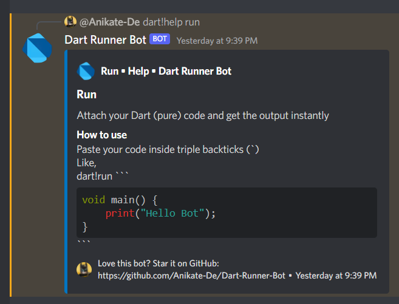
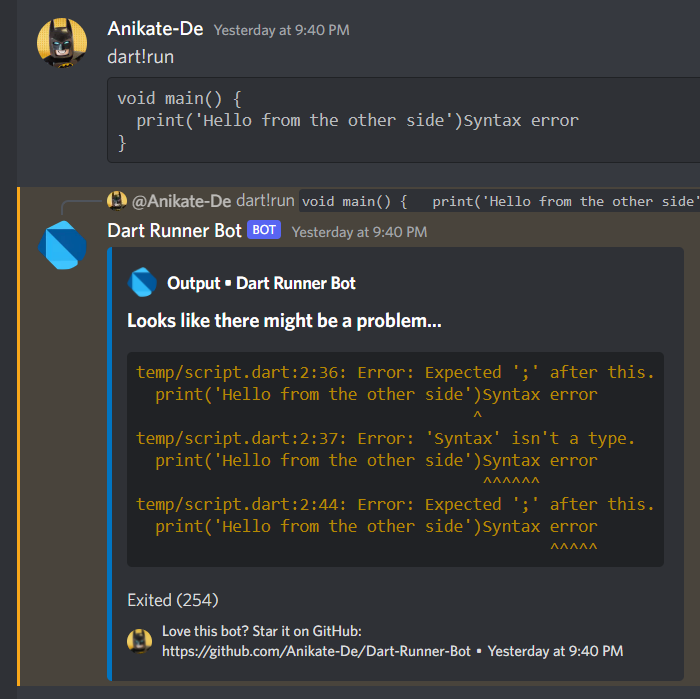
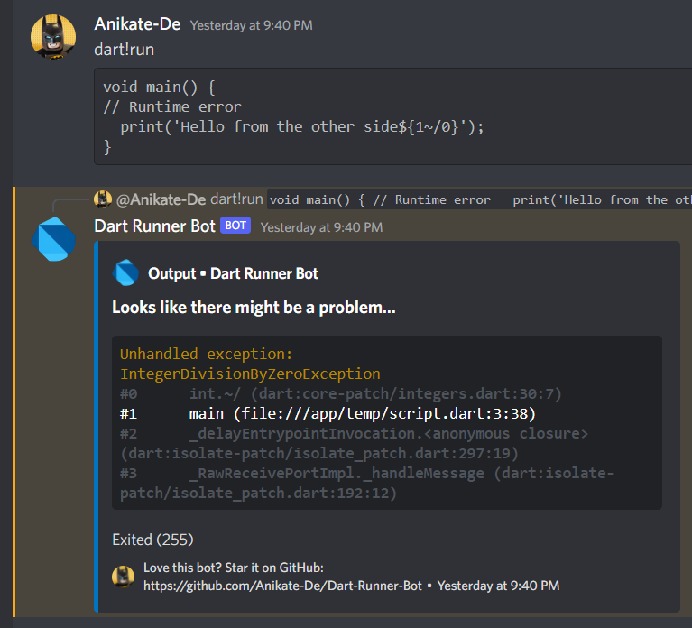

A discord bot, made with Dart, which lets you run your own pure Dart code snippets directly via a discord ping, and get the output in an instant.

Want to share the output of your Dart code, or explain a snippet of code to someone with a realtime execution, or just have fun with print statements? The **`Dart Runner Bot`** is here to the rescue.

This is the first ever Discord bot that lets you execute your Dart code and get the output seamlessly.

Clone this repository and head to the \`Steps to Follow section\` to get started.

## 🌟 Features

- Run Dart Code instantly
- Well-formatted output w/ Error line hinting
- Dedicated help sections for commands
- *more features on the way...*

## 📱 Screenshots
- Help Section

    

- Command Specific Help

     

- Successful Code Execution

     

- Compile Time Error Output

     

- Run-Time Error Output

     

## ❓How to Use

### Pre-requisites
- **Dart SDK** is installed and added to `PATH`

    OR

- **Docker** is installed

### Steps to Follow
- **If you don't have Docker on your system**

    - Create an Application, add a bot, and then get the **`BOT TOKEN`** from your [Discord Developer Account](https://discord.com/developers/)

    - Create a `.env` file in the project root directory with these two values

        ```env
        TOKEN=<your-discord-bot-token>
        PREFIX=dart! <<<replace it with your preferred command prefix, remove this tag>
        ```
    - Get the dependencies, in your terminal, execute -
        ```
        dart pub get
        ```
    - That's it, now you can run the bot -
        ```sh
        dart ./bin/dart_runner_bot.dart
        ```

## 🤝 Contributing

Contributions are always welcome!

See the [Contribution Guide](contributing.md) for ways to get started.

## 📖Lessons Learned

**`Dart Runner Bot`** has been a really exciting and grasping project for me. This was my first attempt at creating a Discord. And starting out with a programming language (Dart) that has close to no discord bot creation tutorials, was definitely not the best idea.

But I did somehow manage to make this bot amazing (in my opinion at least)

I was driven by a friend's (also member of the concerned Discord server) request to add this bot to the server.

I learnt many things along the way, the most notable ones are mentioned below -

- Nyxx Library
- Dart Processes
- Docker Containers
- Dart Isolates
- Discord API
- **and so much more...**

## 💡 Authors

- [@Anikate De](https://www.github.com/Anikate-De)


# 🙇 Acknowledgements

I thank [@yahu1031](https://github.com/yahu1031) for helping me with the development of this bot, and for making his `Flutter Bot` source code publicly available.

Some chunks of really useful code have been taken from that repo. The source code of Dart-Runner-Bot will soon be merged to that project.

## 📝 License

Copyright © 2022-present, Anikate De

This project is licensed under [Apache License 2.0](LICENSE)